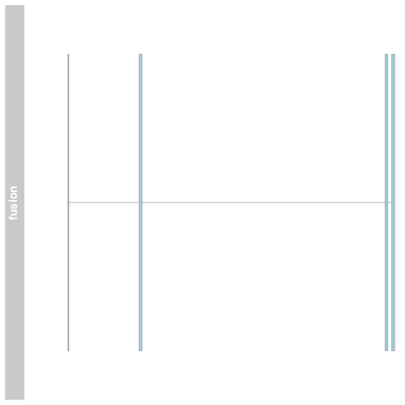
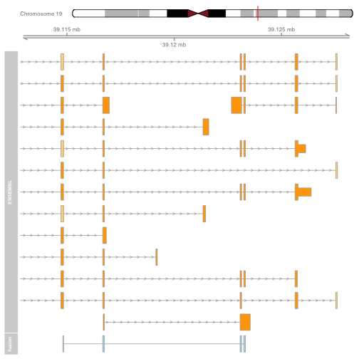
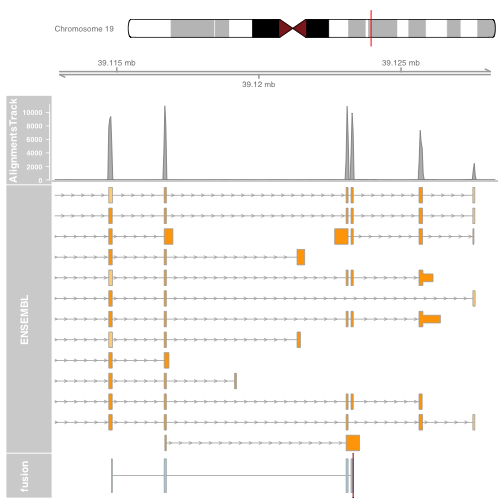
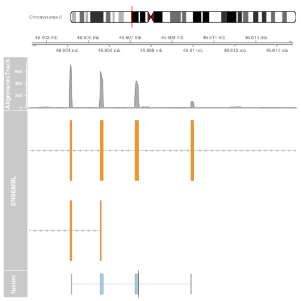
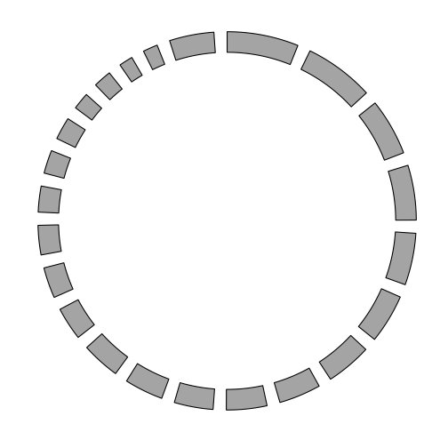
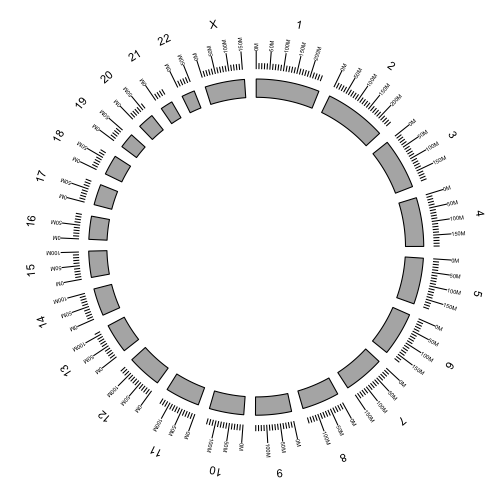
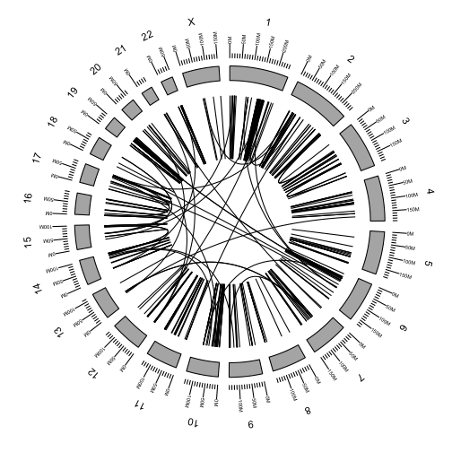
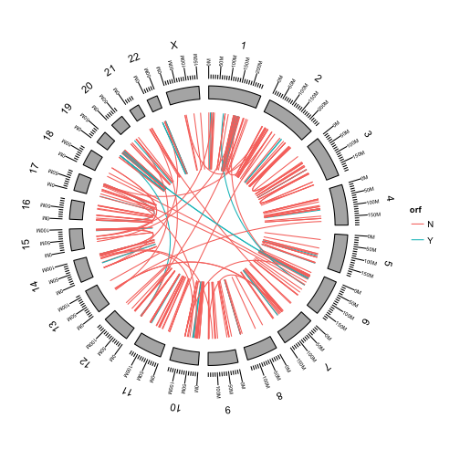

# Gene fusion visualization

## Installation

The required libraries are in bioconductor and can be obtained using the `biocLite` function.  You may not require this code block if you have already installed the libraries.


```r
#source("http://bioconductor.org/biocLite.R")

#biocLite("GenomicRanges")
#biocLite("ggbio")
#biocLite("Gviz")
```

Load the required libraries.


```r
library(ggbio)
```

```
## Loading required package: methods
## Loading required package: BiocGenerics
## Loading required package: parallel
## 
## Attaching package: 'BiocGenerics'
## 
## The following objects are masked from 'package:parallel':
## 
##     clusterApply, clusterApplyLB, clusterCall, clusterEvalQ,
##     clusterExport, clusterMap, parApply, parCapply, parLapply,
##     parLapplyLB, parRapply, parSapply, parSapplyLB
## 
## The following object is masked from 'package:stats':
## 
##     xtabs
## 
## The following objects are masked from 'package:base':
## 
##     anyDuplicated, append, as.data.frame, as.vector, cbind,
##     colnames, do.call, duplicated, eval, evalq, Filter, Find, get,
##     intersect, is.unsorted, lapply, Map, mapply, match, mget,
##     order, paste, pmax, pmax.int, pmin, pmin.int, Position, rank,
##     rbind, Reduce, rep.int, rownames, sapply, setdiff, sort,
##     table, tapply, union, unique, unlist, unsplit
## 
## Loading required package: ggplot2
## Need specific help about ggbio? try mailing 
##  the maintainer or visit http://tengfei.github.com/ggbio/
## 
## Attaching package: 'ggbio'
## 
## The following objects are masked from 'package:ggplot2':
## 
##     geom_bar, geom_rect, geom_segment, ggsave, stat_bin,
##     stat_identity, xlim
```

```r
library(Gviz)
```

```
## Loading required package: S4Vectors
## Loading required package: stats4
## Loading required package: IRanges
## Loading required package: GenomicRanges
## Loading required package: GenomeInfoDb
## Loading required package: grid
```

```r
library(GenomicRanges)
library(knitr)
```

## Read the data

We will be working with predictions from deFuse.  The output of deFuse is a tab delimited text file.  This can be read with the `read.table` command.


```r
results_url = "http://cbwmain.dyndns.info/Module4/packages/cbw_tutorial/gene_fusions/data/HCC1395/defuse/results.filtered.tsv"
data = read.table(results_url, sep="\t", header=T, stringsAsFactors=F)
```

Use the `colnames` function to take a look at the data provided by deFuse.


```r
colnames(data)
```

```
##  [1] "cluster_id"                     "splitr_sequence"               
##  [3] "splitr_count"                   "splitr_span_pvalue"            
##  [5] "splitr_pos_pvalue"              "splitr_min_pvalue"             
##  [7] "adjacent"                       "altsplice"                     
##  [9] "break_adj_entropy1"             "break_adj_entropy2"            
## [11] "break_adj_entropy_min"          "breakpoint_homology"           
## [13] "breakseqs_estislands_percident" "cdna_breakseqs_percident"      
## [15] "deletion"                       "est_breakseqs_percident"       
## [17] "eversion"                       "exonboundaries"                
## [19] "expression1"                    "expression2"                   
## [21] "gene1"                          "gene2"                         
## [23] "gene_align_strand1"             "gene_align_strand2"            
## [25] "gene_chromosome1"               "gene_chromosome2"              
## [27] "gene_end1"                      "gene_end2"                     
## [29] "gene_location1"                 "gene_location2"                
## [31] "gene_name1"                     "gene_name2"                    
## [33] "gene_start1"                    "gene_start2"                   
## [35] "gene_strand1"                   "gene_strand2"                  
## [37] "genome_breakseqs_percident"     "genomic_break_pos1"            
## [39] "genomic_break_pos2"             "genomic_ends1"                 
## [41] "genomic_ends2"                  "genomic_starts1"               
## [43] "genomic_starts2"                "genomic_strand1"               
## [45] "genomic_strand2"                "interchromosomal"              
## [47] "interrupted_index1"             "interrupted_index2"            
## [49] "inversion"                      "library_name"                  
## [51] "max_map_count"                  "max_repeat_proportion"         
## [53] "mean_map_count"                 "min_map_count"                 
## [55] "num_multi_map"                  "num_splice_variants"           
## [57] "orf"                            "read_through"                  
## [59] "repeat_proportion1"             "repeat_proportion2"            
## [61] "span_count"                     "span_coverage1"                
## [63] "span_coverage2"                 "span_coverage_max"             
## [65] "span_coverage_min"              "splice_score"                  
## [67] "splicing_index1"                "splicing_index2"               
## [69] "transcript1"                    "transcript2"                   
## [71] "probability"
```

Many features and annotations are provided.  We will primarily be intersted in the chromosome, strand, start and end annotations, and `cluster_id` which is the unique identifier assigned to each prediction.

We will concentrate on the EIF3K-CYP39A1 fusion.  Filter the data for this fusion.


```r
gene_names = c("EIF3K", "CYP39A1")
gene_names
```

```
## [1] "EIF3K"   "CYP39A1"
```

```r
fusion = data[data$gene_name1 %in% gene_names & data$gene_name2 %in% gene_names,][2,]
fusion$splitr_sequence <- NULL
fusion
```

```
##     cluster_id splitr_count splitr_span_pvalue splitr_pos_pvalue
## 315    4311846          155        1.62879e-06         0.8150972
##     splitr_min_pvalue adjacent altsplice break_adj_entropy1
## 315         0.6862973        N         N           3.316957
##     break_adj_entropy2 break_adj_entropy_min breakpoint_homology
## 315           3.393843              3.316957                   6
##     breakseqs_estislands_percident cdna_breakseqs_percident deletion
## 315                              0              0.005789249        N
##     est_breakseqs_percident eversion exonboundaries expression1
## 315             0.001663894        N              Y       22357
##     expression2           gene1           gene2 gene_align_strand1
## 315        5935 ENSG00000178982 ENSG00000146233                  +
##     gene_align_strand2 gene_chromosome1 gene_chromosome2 gene_end1
## 315                  -               19                6  39127595
##     gene_end2 gene_location1 gene_location2 gene_name1 gene_name2
## 315  46620523         coding         coding      EIF3K    CYP39A1
##     gene_start1 gene_start2 gene_strand1 gene_strand2
## 315    39109735    46517541            +            -
##     genome_breakseqs_percident genomic_break_pos1 genomic_break_pos2
## 315                          0           39123318           46607405
##                           genomic_ends1
## 315 39114837,39116742,39123136,39123317
##                           genomic_ends2
## 315 46604219,46605715,46607405,46609900
##                         genomic_starts1
## 315 39114815,39116668,39123070,39123241
##                         genomic_starts2 genomic_strand1 genomic_strand2
## 315 46604188,46605566,46607231,46609900               +               +
##     interchromosomal interrupted_index1 interrupted_index2 inversion
## 315                Y                  -                  -         N
##     library_name max_map_count max_repeat_proportion mean_map_count
## 315      HCC1395             2                     0       1.176471
##     min_map_count num_multi_map num_splice_variants orf read_through
## 315             1             3                   1   Y            N
##     repeat_proportion1 repeat_proportion2 span_count span_coverage1
## 315                  0                  0         17       1.989058
##     span_coverage2 span_coverage_max span_coverage_min splice_score
## 315       1.947271          1.989058          1.947271            4
##     splicing_index1 splicing_index2                     transcript1
## 315               -               - ENSG00000178982|ENST00000591409
##                         transcript2 probability
## 315 ENSG00000146233|ENST00000275016    0.653798
```

The `GViz` package works best with UCSC style chromosome names.  Convert the `gene_chromosome1` and `gene_chromosome2` fields.


```r
fusion$gene_chromosome1 = paste("chr", fusion$gene_chromosome1, sep="")
fusion$gene_chromosome2 = paste("chr", fusion$gene_chromosome2, sep="")
fusion$gene_chromosome1
```

```
## [1] "chr19"
```

```r
fusion$gene_chromosome2
```

```
## [1] "chr6"
```

Extract the chromosome and strand of the the fusion.  Here the strand is referring to the strand of the genome, which is different than the strand on a gene which itself may be on the "-" strand of the genome.


```r
chromosome1 = fusion$gene_chromosome1
strand1 = fusion$genomic_strand1
```

Defuse predicts a fusion contig based on spanning and split RNA-Seq reads.  The contig is a set of (potentially multiple) exons adjacent to the fusion boundary.  The starts and ends of these exons are encoded in the `genomic_starts1/2` and `genomic_ends1/2` fields as comma separated lists.


```r
starts1 = as.numeric(strsplit(fusion$genomic_starts1, ",")[[1]])
ends1 = as.numeric(strsplit(fusion$genomic_ends1, ",")[[1]])
starts1
```

```
## [1] 39114815 39116668 39123070 39123241
```

```r
ends1
```

```
## [1] 39114837 39116742 39123136 39123317
```

Many plotting funcitons in R take `GRanges` (`GenomicRanges` package) objects containing information about the genomic regions to be plotted.  We will encode the fusion exons as `GRanges` objects.


```r
fusionexons1 <- GRanges(
  seqnames = chromosome1,
  ranges = IRanges(start = starts1, end = ends1),
  strand = strand1,
  group = rep("fusionexons", length(starts1)))
```

## Plot a fusion using Gviz

We can plot the fusion exons in `Gviz` by creating a gene region track using the `GRanges` to define the exons and providing som additional information.  Plot the track using the `plotTracks` function.


```r
fusionTrack <- AnnotationTrack(fusionexons1, genome = "hg19", name = "fusion",
  groupAnnotation = "group", shape = "box", stacking = "dense")

plotTracks(list(fusionTrack))
```

 

The plot shows the exons of the fusion, though in isolation the exons are not very interesting.  Add an ideogram with `IdeogramTrack`, genomic location using `GenomeAxisTrack`, and ensembl gene models using `BiomartGeneRegionTrack`.


```r
plot.start = min(starts1) - 2000
plot.end = max(ends1) + 5000

itrack <- IdeogramTrack(genome = "hg19", chromosome = chromosome1)

gtrack <- GenomeAxisTrack(genome = "hg19", chromosome = chromosome1)

biomTrack <- BiomartGeneRegionTrack(genome = "hg19",
  chromosome = chromosome1, start = plot.start, end = plot.end,
  name = "ENSEMBL")

plotTracks(list(itrack, gtrack, biomTrack, fusionTrack), from = plot.start, to = plot.end)
```

 

It is also possible to plot read alignments and coverage directly from a bam file using the AlignmentsTrack.  The bam file should ideally have ucsc chromosome names to have the optimal compatibility with `GViz`.  Set the `sizes` argument so that the alignments track doesnt take over the entire plot.


```r
bam_url = "http://cbwmain.dyndns.info/Module4/HCC1395/rnaseq/genes/HCC1395_EIF3K.bam"
bai_url = "http://cbwmain.dyndns.info/Module4/HCC1395/rnaseq/genes/HCC1395_EIF3K.bam.bai"

bam_file <- basename(bam_url)
bai_file <- basename(bai_url)

download.file(bam_url, bam_file)
download.file(bai_url, bai_file)

alTrack <- AlignmentsTrack(bam_file,
  isPaired = TRUE, type = "coverage")

plotTracks(list(itrack, gtrack, alTrack, biomTrack, fusionTrack),
  chromosome = chromosome1, from = plot.start, to = plot.end, 
  sizes = c(0.5, 0.5, 1, 3, 0.5))
```

 

Try other _types_ of alignment plotting, by setting the `type` argument to "coverage", "sashimi" or "pileup".  For sashimi plots, use `type = c("sashimi", "coverage")`.

### Visualizing the fusion break end

We will visualize the fusion break end using a highlight track overlayed on the fusion track.

Create the highlight track starting and ending at the fusion break end.  Apply to the fusion track.


```r
brkendTrack <- HighlightTrack(trackList = list(fusionTrack),
  chromosome = chromosome1, start = fusion$genomic_break_pos1,
  end = fusion$genomic_break_pos1,
  inBackground = FALSE, col = "darkred", fill = NA)
```

Plot the highlight track and gene model and ideogram tracks.

> Note: The highlight should be plotted _instead_ of the track its highlighting.  Plotting the highlight track will plot the fusion track for you.


```r
plotTracks(list(itrack, gtrack, alTrack, biomTrack, brkendTrack),
  chromosome = chromosome1, from = plot.start, to = plot.end,
  sizes = c(0.5, 0.5, 1, 3, 0.5))
```

 

Plotting the fusion break end in the context of the gene models will now give us an idea for which intron of the gene harbours the associated genomic rearrangement breakpoint.

### Plot the other end of the fusion


```r
starts2 = as.numeric(strsplit(fusion$genomic_starts2, ",")[[1]])
ends2 = as.numeric(strsplit(fusion$genomic_ends2, ",")[[1]])

fusionexons2 <- GRanges(
  seqnames = fusion$gene_chromosome2,
  ranges = IRanges(
    start = starts2,
    end = ends2),
  strand = fusion$genomic_strand2,
  group = rep("fusionexons", length(starts2)))

fusionTrack <- AnnotationTrack(fusionexons2,
  genome = "hg19", name = "fusion", 
  shape = "box", stacking = "dense",
  groupAnnotation = "group")

brkendTrack <- HighlightTrack(trackList = list(fusionTrack),
  chromosome = fusion$gene_chromosome2,
  start = fusion$genomic_break_pos2,
  end = fusion$genomic_break_pos2,
  inBackground = FALSE, col = "darkred", fill = NA)

bam_url = "http://cbwmain.dyndns.info/Module4/HCC1395/rnaseq/genes/HCC1395_CYP39A1.bam"
bai_url = "http://cbwmain.dyndns.info/Module4/HCC1395/rnaseq/genes/HCC1395_CYP39A1.bam.bai"

bam_file <- basename(bam_url)
bai_file <- basename(bai_url)

download.file(bam_url, bam_file)
download.file(bai_url, bai_file)

alTrack <- AlignmentsTrack(bam_file,
  isPaired = TRUE, type = "coverage")

plot.start = min(fusionexons2@ranges@start) - 2000
plot.end = max(fusionexons2@ranges@start + fusionexons2@ranges@width) + 5000

itrack <- IdeogramTrack(genome = "hg19", chromosome = fusion$gene_chromosome2)

gtrack <- GenomeAxisTrack(genome = "hg19", chromosome = fusion$gene_chromosome2)

biomTrack <- BiomartGeneRegionTrack(genome = "hg19",
  chromosome = fusion$gene_chromosome2, start = plot.start, end = plot.end,
  name = "ENSEMBL")

p2 = plotTracks(list(itrack, gtrack, alTrack, biomTrack, brkendTrack),
  from = plot.start, to = plot.end,
  sizes = c(0.5, 0.5, 1, 3, 0.5))
```

 

## Plot a _circos_ of all fusions using ggbio

We will plot the full fusion dataset as a _circos_ plot using the `ggbio` package.  A small amount of setup is required.

### Reference genome preparation

First obtain the human genome hg19 chromosome lengths from the `BSgenome.Hsapiens.UCSC.hg19` package.  Create a `SeqInfo` object for the chromosome sequences of hg19.


```r
library(BSgenome.Hsapiens.UCSC.hg19)
```

```
## Loading required package: BSgenome
## Loading required package: Biostrings
## Loading required package: rtracklayer
```

```r
genome <- Seqinfo(
  seqnames = seqnames(Hsapiens),
  seqlengths = seqlengths(Hsapiens),
  genome = "hg19"
)
```

We will be working with NCBI 1, 2, 3... named chromosomes rather than chr1, chr2, chr3...


```r
seqlevelsStyle(genome) <- "NCBI"
```

Subset to the chromosomes we are interested in plotting.


```r
chromosomes = as.character(c(seq(22), "X"))
genome = genome[chromosomes]
```

We will also require the chromosomes represented as a `GRanges` object.


```r
genome.ranges = GRanges(
  seqnames = seqnames(genome),
  strand = "*",
  ranges = IRanges(start = 1, width = seqlengths(genome)),
  seqinfo = genome
)
genome.ranges
```

```
## GRanges object with 23 ranges and 0 metadata columns:
##        seqnames         ranges strand
##           <Rle>      <IRanges>  <Rle>
##    [1]        1 [1, 249250621]      *
##    [2]        2 [1, 243199373]      *
##    [3]        3 [1, 198022430]      *
##    [4]        4 [1, 191154276]      *
##    [5]        5 [1, 180915260]      *
##    ...      ...            ...    ...
##   [19]       19 [1,  59128983]      *
##   [20]       20 [1,  63025520]      *
##   [21]       21 [1,  48129895]      *
##   [22]       22 [1,  51304566]      *
##   [23]        X [1, 155270560]      *
##   -------
##   seqinfo: 23 sequences from hg19 genome
```

### Plotting chromosomes in a circle

Using the `GRanges` representation of the chromosome lengths, we can draw a basic plot of the chromosomes in a circle.


```r
p <- ggbio() +
  circle(genome.ranges, geom = "ideo", fill = "gray70")
p
```

 

Additional tracks are added using the `+` operator.  Add a scale and chromosome name.


```r
p <- ggbio() +
  circle(genome.ranges, geom = "ideo", fill = "gray70") +
  circle(genome.ranges, geom = "scale", size = 2) +
  circle(genome.ranges, geom = "text", aes(label = seqnames), vjust = -1, size = 4)
p
```

 

We are now ready the plot arcs within and between chromosomes representing fusions between genes.

Subset the data by the chromosomes we would like to plot.  Also remove low probability events.


```r
data = data[
  data$gene_chromosome1 %in% as.character(chromosomes) & 
  data$gene_chromosome2 %in% as.character(chromosomes) &
  data$probability > 0.75,]
```

### Creating a `GRanges` object for your fusions

Create a `GRanges` object for the fusions.  To do this, we must first create a GRanges object for all the fusion ends together, then split that object into a `GrangesList` with two elements, one for fusion end 1 and another for fusion end 2.  Finally, we add fusion end 2 to the meta data of fusion end 1.

First step, create a `GRanges` object of all the data, using the `c()` function to concatenate chromosome, strand and position.  Add the `mate` metadata field to represent the end of the fusion for each entry in the `GRanges` object.  

> Important: you must provide a `SeqInfo` object as `ggbio` requires information about the chromosome lengths 


```r
fusion_ends = GRanges(
  seqnames = c(data$gene_chromosome1, data$gene_chromosome2),
  strand = c(data$genomic_strand1, data$genomic_strand2),
  ranges = IRanges(start=c(data$genomic_break_pos1, data$genomic_break_pos2), width=1),
  seqinfo = genome,
  mate = c(rep(0, length(data$gene_chromosome1)), rep(1, length(data$gene_chromosome2))))
```

Second step, split the `GRanges` object on the `mate` field to create a `GRangesList` with two elements, one containing the fusion ends in gene 1 and the other the fusion ends in gene 2.


```r
fusion_ends_list <- split(fusion_ends, values(fusion_ends)$mate)
```

Third step, create a fusions `GRanges` object that is the gene 1 fusion ends linked to the gene 2 fusion ends.  Create the `fusions` object for the first end, then add the second end as the `fusedto` metadata field.


```r
fusions = fusion_ends_list[[1]]
fusions$fusedto = fusion_ends_list[[2]]
```

### Plotting links

Add the rearrangements to the plot using the `link` geom argument.


```r
p <- ggbio() +
  circle(fusions, geom = "link", linked.to = "fusedto") +
  circle(genome.ranges, geom = "ideo", fill = "gray70") +
  circle(genome.ranges, geom = "scale", size = 2) +
  circle(genome.ranges, geom = "text", aes(label = seqnames), vjust = -1, size = 4)
p
```

 

We can color the links by any of the fusion attributes in the table.


```r
colnames(data)
```

```
##  [1] "cluster_id"                     "splitr_sequence"               
##  [3] "splitr_count"                   "splitr_span_pvalue"            
##  [5] "splitr_pos_pvalue"              "splitr_min_pvalue"             
##  [7] "adjacent"                       "altsplice"                     
##  [9] "break_adj_entropy1"             "break_adj_entropy2"            
## [11] "break_adj_entropy_min"          "breakpoint_homology"           
## [13] "breakseqs_estislands_percident" "cdna_breakseqs_percident"      
## [15] "deletion"                       "est_breakseqs_percident"       
## [17] "eversion"                       "exonboundaries"                
## [19] "expression1"                    "expression2"                   
## [21] "gene1"                          "gene2"                         
## [23] "gene_align_strand1"             "gene_align_strand2"            
## [25] "gene_chromosome1"               "gene_chromosome2"              
## [27] "gene_end1"                      "gene_end2"                     
## [29] "gene_location1"                 "gene_location2"                
## [31] "gene_name1"                     "gene_name2"                    
## [33] "gene_start1"                    "gene_start2"                   
## [35] "gene_strand1"                   "gene_strand2"                  
## [37] "genome_breakseqs_percident"     "genomic_break_pos1"            
## [39] "genomic_break_pos2"             "genomic_ends1"                 
## [41] "genomic_ends2"                  "genomic_starts1"               
## [43] "genomic_starts2"                "genomic_strand1"               
## [45] "genomic_strand2"                "interchromosomal"              
## [47] "interrupted_index1"             "interrupted_index2"            
## [49] "inversion"                      "library_name"                  
## [51] "max_map_count"                  "max_repeat_proportion"         
## [53] "mean_map_count"                 "min_map_count"                 
## [55] "num_multi_map"                  "num_splice_variants"           
## [57] "orf"                            "read_through"                  
## [59] "repeat_proportion1"             "repeat_proportion2"            
## [61] "span_count"                     "span_coverage1"                
## [63] "span_coverage2"                 "span_coverage_max"             
## [65] "span_coverage_min"              "splice_score"                  
## [67] "splicing_index1"                "splicing_index2"               
## [69] "transcript1"                    "transcript2"                   
## [71] "probability"
```

First add the `orf` attribute to the metadata of our `GRanges` object.


```r
fusions$orf = data$orf
```

Use `aes` to color the fusions by whether or not they preserve the open reading frame of the fusion.


```r
p <- ggbio() +
  circle(fusions, geom = "link", linked.to = "fusedto", aes(color = orf)) +
  circle(genome.ranges, geom = "ideo", fill = "gray70") +
  circle(genome.ranges, geom = "scale", size = 2) +
  circle(genome.ranges, geom = "text", aes(label = seqnames), vjust = -1, size = 4)
p
```

 

